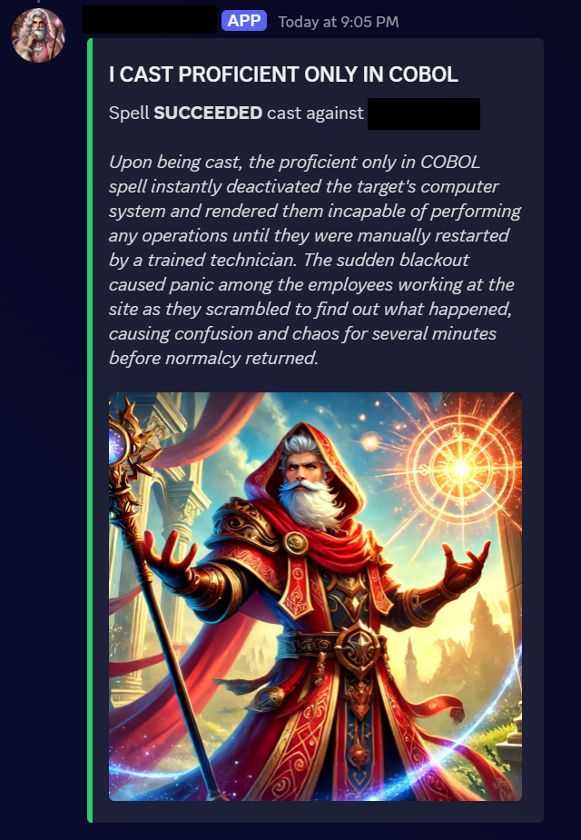

# Spell Bot

**A fun little bot you can use to cast spells at each other in your discord server ✨**

I built this fun little bot as part of my blog article [here](https://kiwimike.me/?p=137).

## Built-in cogs

Serveral cogs have been built and enabled in this bot to enable certain functionality

### Audit

- Logs deleted messages to an audit channel
- Detect and log messages with certain keywords to the audit channel
- Bot message log to review deleted or suspicious messages, even if unavailable on discord

### Fun

Use `/cast` and type in a spell name and a target on your server to cast a spell, with a 50/50 chance to succeed or fail, described by Llama2.

<!---->

# Installing and Using 

## Requirements
- Docker and Docker-Compose
- Have installed the [Nvidia Container Toolkit](https://docs.nvidia.com/datacenter/cloud-native/container-toolkit/latest/install-guide.html)
- A Nvidia GPU with at least 4GB of VRAM 
- A discord bot token with administrator privelleges

## Installing

1. Clone the git repository
2. Create a `.env` file and set the variables `AUDIT_CHANNEL_ID`, `API_TOKEN` and `SERVER_ID` to their respective values
3. Run `docker compose up --build`, it will interactively build the containers, this is recommended to do initially, as the model can sometimes take a while to download. 
4. Test out the bot in your server (type `/` and you will see the bot's commands listed)

